# ERP Central 系統規格文件

## 1. 專案概述

### 1.1 專案名稱
ERP Central - 企業資源規劃系統

### 1.2 專案目標
建立一個現代化、模組化的 ERP 系統，整合企業各部門的業務流程，提供即時的數據分析和 AI 輔助功能。

### 1.3 技術架構
- **前端**: Next.js 15 + React 18 + TypeScript
- **UI 框架**: ShadCN UI + Tailwind CSS
- **狀態管理**: Zustand + React Context
- **數據庫**: SQLite (開發) / PostgreSQL (生產)
- **ORM**: Prisma
- **AI 整合**: Firebase Genkit + Google AI
- **測試**: Jest + React Testing Library

## 2. 系統架構

### 2.1 整體架構圖

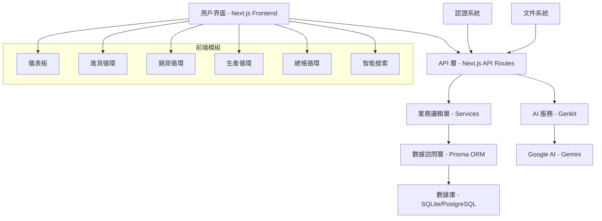

### 2.2 數據庫架構圖

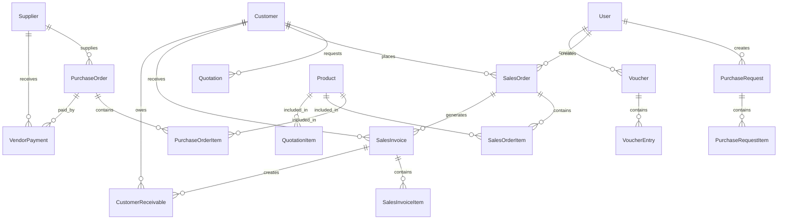

## 3. 功能模組規格

### 3.1 進貨循環模組

#### 3.1.1 請購單管理
**功能描述**: 管理採購申請流程

**業務流程圖**:
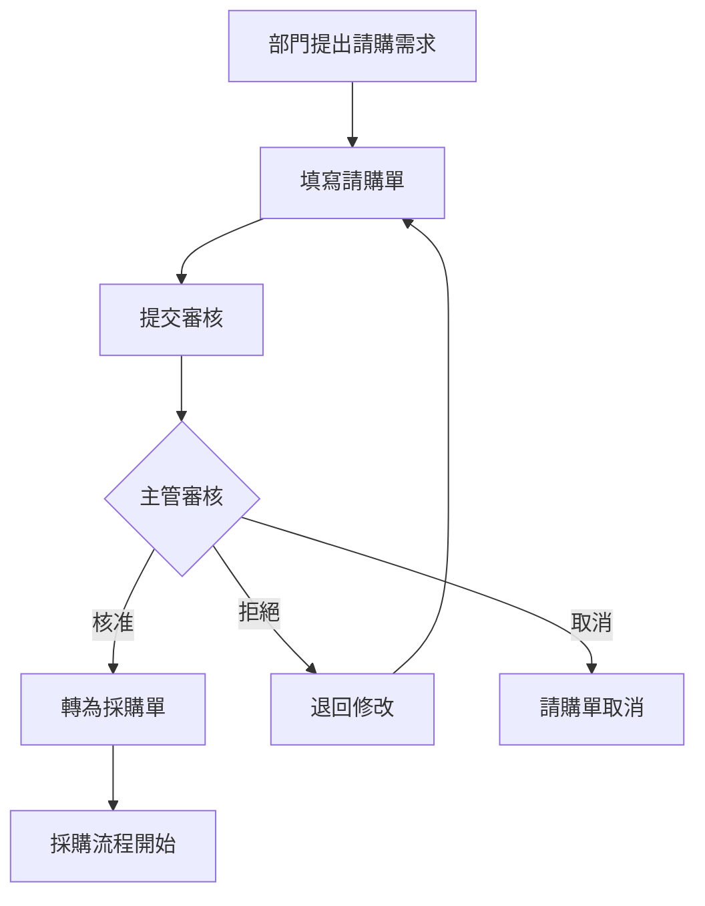

**循序圖**:
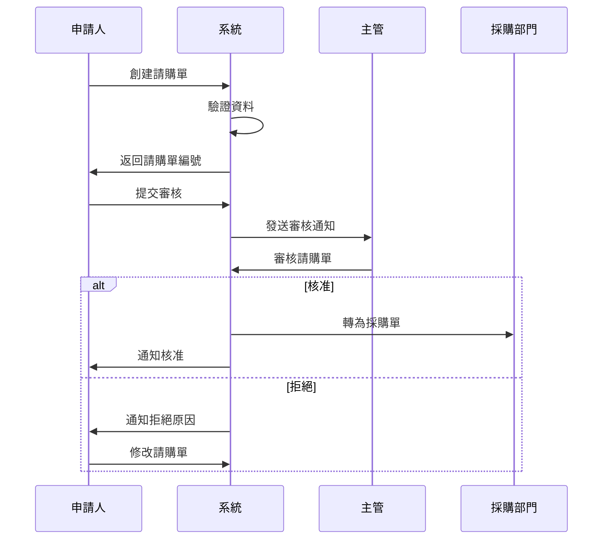

**API 端點**:
- `GET /api/purchasing/requests` - 獲取請購單列表
- `POST /api/purchasing/requests` - 創建請購單
- `GET /api/purchasing/requests/[id]` - 獲取請購單詳情
- `PUT /api/purchasing/requests/[id]` - 更新請購單
- `DELETE /api/purchasing/requests/[id]` - 刪除請購單
- `POST /api/purchasing/requests/[id]/approve` - 核准請購單
- `POST /api/purchasing/requests/[id]/reject` - 拒絕請購單

#### 3.1.2 採購單管理
**功能描述**: 管理正式採購訂單

**業務流程圖**:
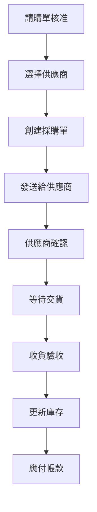

**循序圖**:
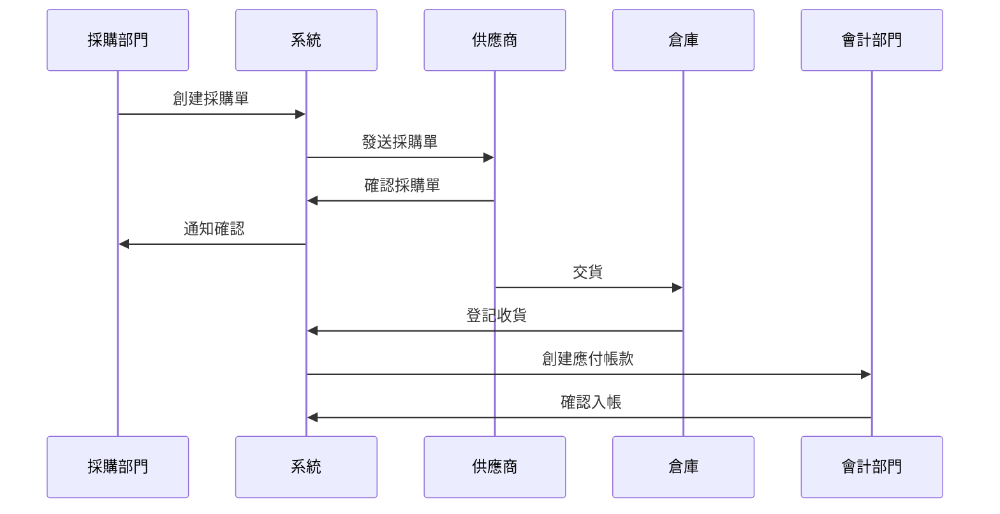

#### 3.1.3 驗收單管理
**功能描述**: 管理收貨驗收流程

**循序圖**:
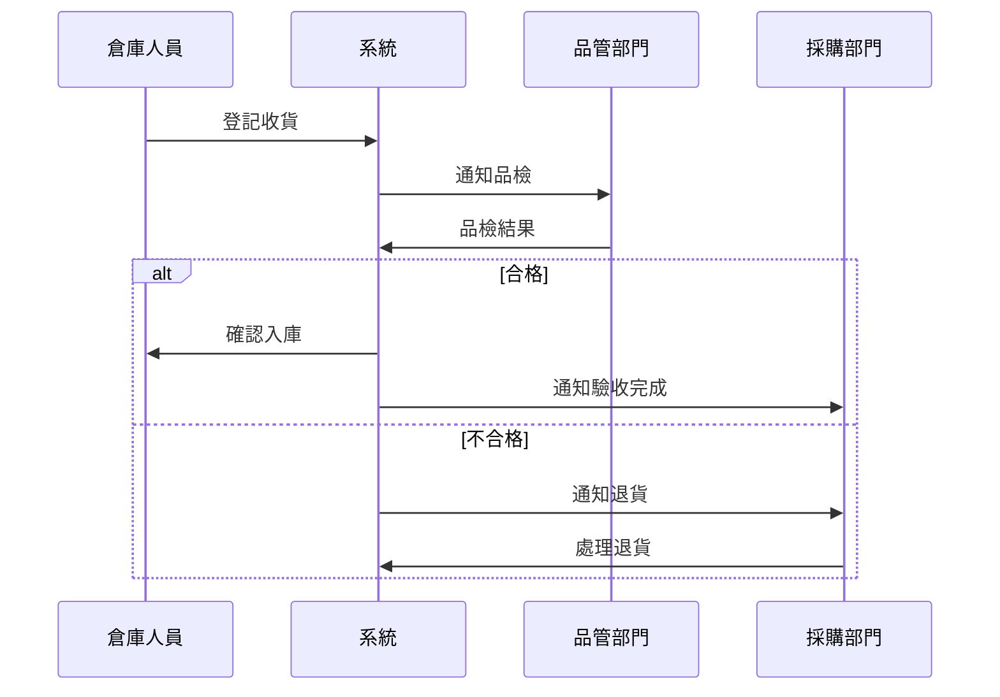

#### 3.1.4 廠商付款管理
**功能描述**: 管理應付帳款付款

**循序圖**:
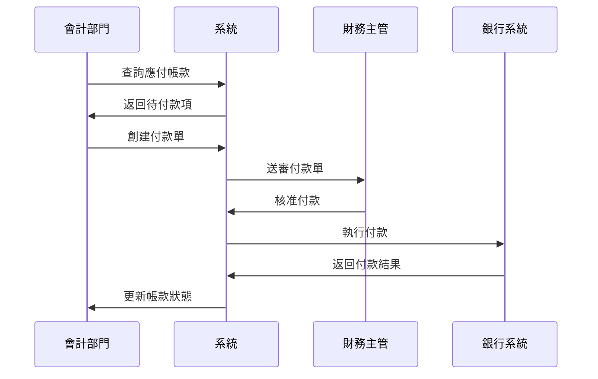

### 3.2 銷貨循環模組

#### 3.2.1 報價單管理
**功能描述**: 管理客戶報價流程

**業務流程圖**:
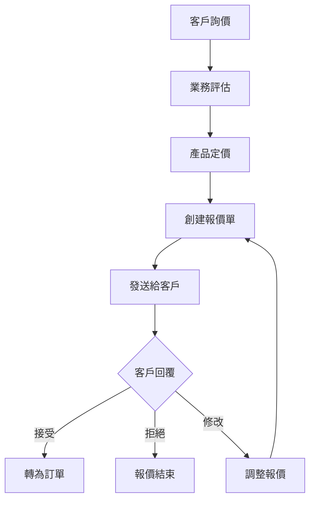

**循序圖**:
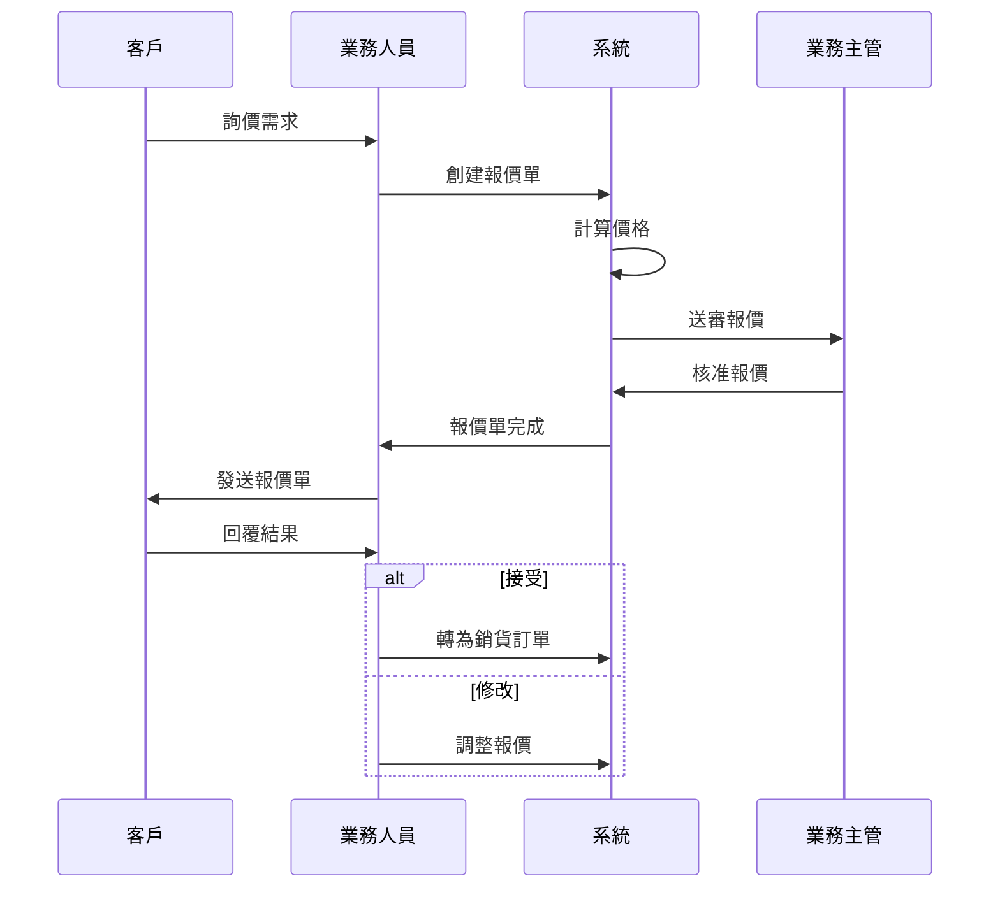

#### 3.2.2 銷貨訂單管理
**功能描述**: 管理客戶訂單流程

**循序圖**:
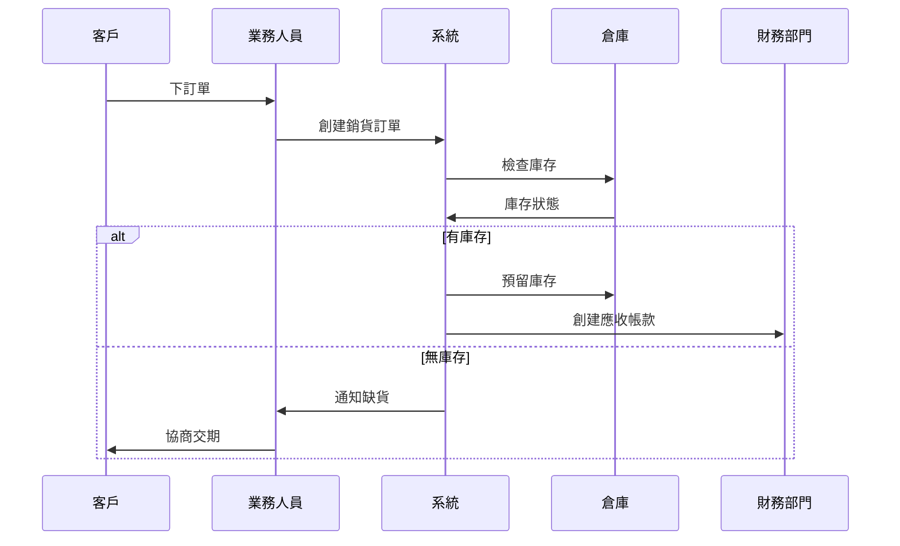

#### 3.2.3 銷貨發票管理
**功能描述**: 管理出貨發票

**循序圖**:
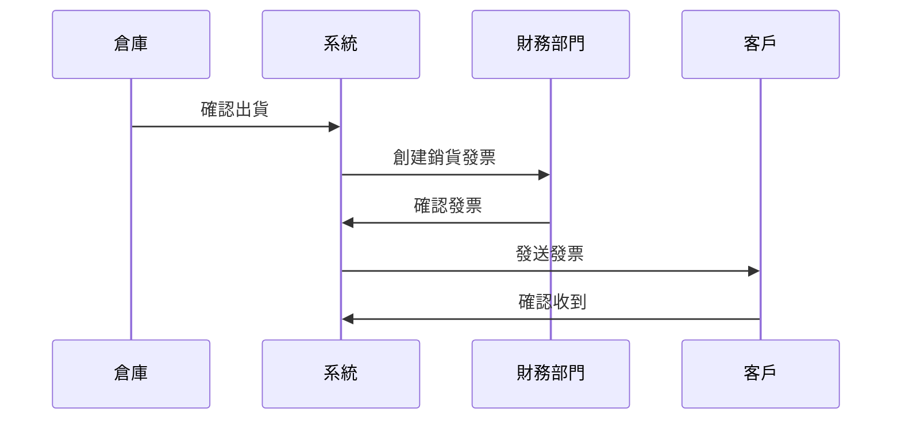

#### 3.2.4 客戶應收帳款管理
**功能描述**: 管理應收帳款

**循序圖**:
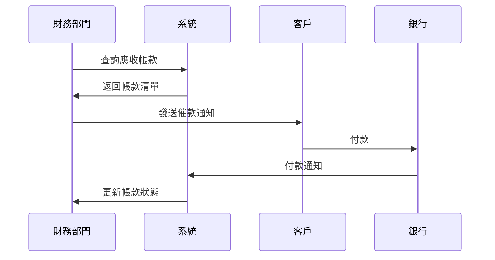

### 3.3 總帳循環模組

#### 3.3.1 傳票管理
**功能描述**: 管理會計傳票

**業務流程圖**:
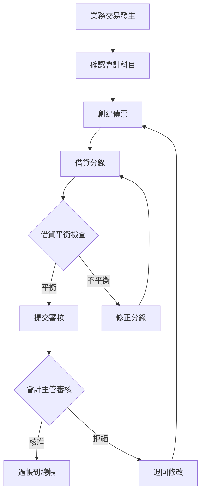

**循序圖**:
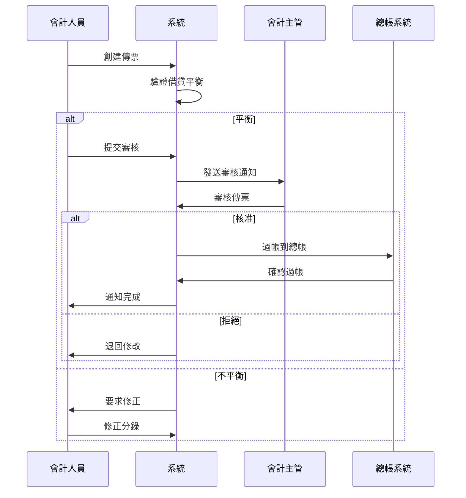

#### 3.3.2 總帳科目架構
**功能描述**: 管理會計科目架構

**科目架構圖**:
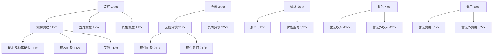

### 3.4 系統整體循序圖

#### 3.4.1 用戶登入流程
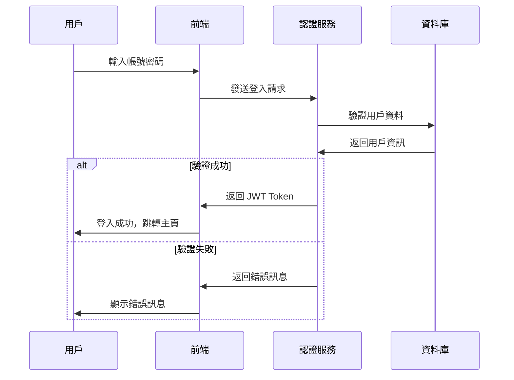

#### 3.4.2 智能搜索流程
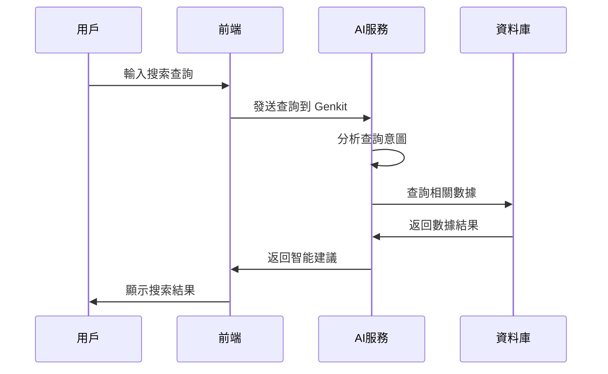

### 3.5 系統類別圖

```mermaid
classDiagram
    class User {
        +id: string
        +username: string
        +email: string
        +role: string
        +createdAt: Date
        +login()
        +logout()
        +updateProfile()
    }

    class PurchaseRequest {
        +id: string
        +requestNumber: string
        +requestDate: Date
        +status: string
        +totalAmount: number
        +createRequest()
        +approve()
        +reject()
    }

    class PurchaseOrder {
        +id: string
        +orderNumber: string
        +orderDate: Date
        +supplierId: string
        +status: string
        +totalAmount: number
        +createOrder()
        +confirm()
        +cancel()
    }

    class SalesOrder {
        +id: string
        +orderNumber: string
        +orderDate: Date
        +customerId: string
        +status: string
        +totalAmount: number
        +createOrder()
        +ship()
        +invoice()
    }

    class Voucher {
        +id: string
        +voucherNumber: string
        +voucherDate: Date
        +description: string
        +totalDebit: number
        +totalCredit: number
        +createVoucher()
        +post()
        +reverse()
    }

    class Product {
        +id: string
        +productCode: string
        +productName: string
        +unitPrice: number
        +stockQuantity: number
        +updateStock()
        +calculateCost()
    }

    User ||--o{ PurchaseRequest : creates
    User ||--o{ PurchaseOrder : manages
    User ||--o{ SalesOrder : handles
    User ||--o{ Voucher : posts
    PurchaseRequest ||--|| PurchaseOrder : converts_to
    SalesOrder ||--o{ Product : contains
    PurchaseOrder ||--o{ Product : includes
```

## 4. 用戶界面設計

### 4.1 設計原則
- **一致性**: 統一的設計語言和交互模式
- **易用性**: 直觀的操作流程和清晰的信息架構
- **響應式**: 支持桌面和移動設備
- **無障礙**: 符合 WCAG 2.1 標準

### 4.2 色彩規範
- **主色**: Blue (#4681C4) - HSL: 205 65% 50%
- **背景色**: Light Gray (#F0F4F8) - HSL: 220 25% 97%
- **強調色**: Teal (#3E8A8A) - HSL: 175 50% 45%
- **成功色**: Green (#10B981)
- **警告色**: Yellow (#F59E0B)
- **錯誤色**: Red (#EF4444)

### 4.3 字體規範
- **標題字體**: 'Poppins', sans-serif
- **內文字體**: 'PT Sans', sans-serif
- **代碼字體**: 'Fira Code', monospace

## 5. API 設計規範

### 5.1 RESTful API 設計原則
- 使用標準 HTTP 方法 (GET, POST, PUT, DELETE)
- 統一的響應格式
- 適當的 HTTP 狀態碼
- 分頁和過濾支持

### 5.2 響應格式
```typescript
// 成功響應
{
  "success": true,
  "data": any,
  "message": string
}

// 錯誤響應
{
  "success": false,
  "error": string,
  "details": any
}

// 分頁響應
{
  "success": true,
  "data": any[],
  "pagination": {
    "total": number,
    "page": number,
    "pageSize": number,
    "totalPages": number,
    "hasNext": boolean,
    "hasPrev": boolean
  }
}
```

### 5.3 認證和授權
- JWT Token 認證
- 角色基礎訪問控制 (RBAC)
- API 速率限制

## 6. 數據庫設計

### 6.1 設計原則
- 正規化設計減少數據冗餘
- 適當的索引優化查詢性能
- 外鍵約束保證數據完整性
- 軟刪除支持數據恢復

### 6.2 核心實體
- **User**: 用戶管理
- **Product**: 產品主檔
- **Customer**: 客戶主檔
- **Supplier**: 供應商主檔
- **PurchaseOrder**: 採購單
- **SalesOrder**: 銷貨單
- **Voucher**: 會計傳票

## 7. 安全性設計

### 7.1 認證安全
- 密碼加密存儲 (bcrypt)
- JWT Token 有效期管理
- 登入失敗次數限制

### 7.2 數據安全
- SQL 注入防護 (Prisma ORM)
- XSS 攻擊防護
- CSRF 攻擊防護
- 敏感數據加密

### 7.3 訪問控制
- 角色權限管理
- 資源級別權限控制
- API 訪問日誌

## 8. 性能優化

### 8.1 前端優化
- 代碼分割和懶加載
- 圖片優化和 CDN
- 緩存策略
- Bundle 大小優化

### 8.2 後端優化
- 數據庫查詢優化
- 連接池管理
- 緩存機制 (Redis)
- API 響應壓縮

## 9. 測試策略

### 9.1 測試類型
- **單元測試**: Jest + React Testing Library
- **集成測試**: API 端點測試
- **端到端測試**: Playwright (未來)
- **性能測試**: 負載測試 (未來)

### 9.2 測試覆蓋率目標
- 單元測試覆蓋率 > 80%
- API 測試覆蓋率 > 90%
- 關鍵業務流程 100% 覆蓋

## 10. 部署和維運

### 10.1 部署環境
- **開發環境**: 本地開發
- **測試環境**: Staging 環境
- **生產環境**: 雲端部署

### 10.2 CI/CD 流程
- 代碼提交觸發自動測試
- 測試通過後自動部署到測試環境
- 手動審核後部署到生產環境

### 10.3 監控和日誌
- 應用性能監控 (APM)
- 錯誤追蹤和報警
- 業務指標監控
- 安全事件監控

## 11. 未來擴展

### 11.1 功能擴展
- 生產循環模組完整實現
- 成本循環模組
- 薪資循環模組
- 固定資產循環模組
- 現金流循環模組

### 11.2 技術擴展
- 微服務架構遷移
- 多租戶支持
- 國際化 (i18n)
- 移動應用開發

### 11.3 AI 功能擴展
- 智能報表生成
- 預測分析
- 異常檢測
- 自動化工作流程
