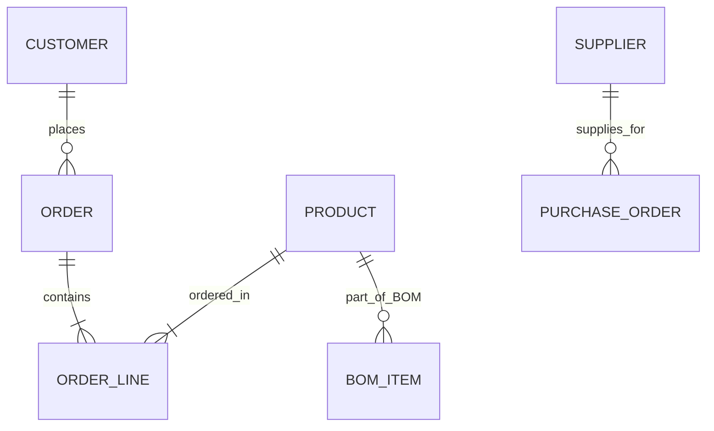
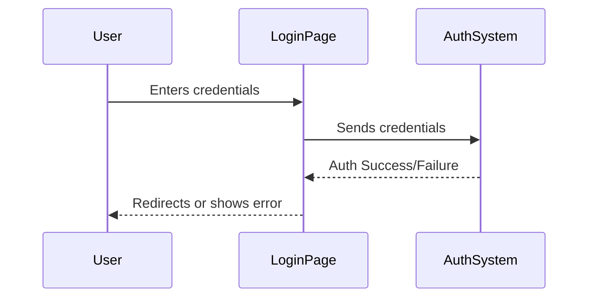
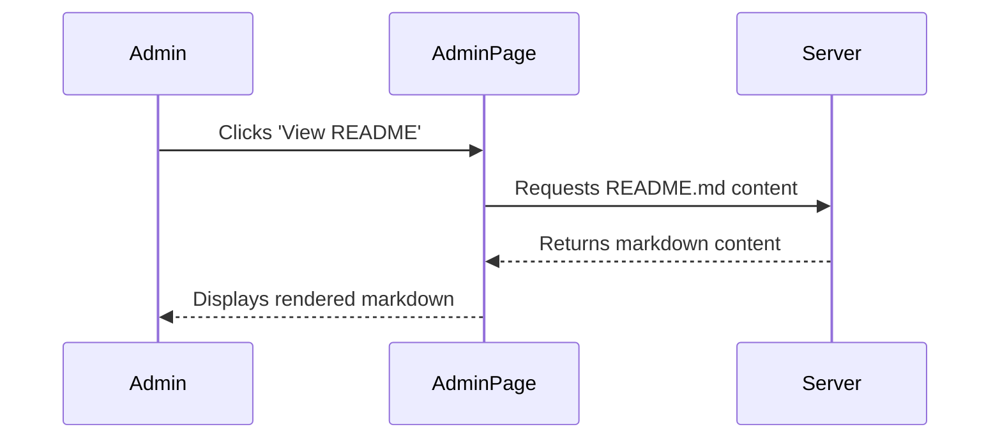

# Specification Document

This document outlines the specifications of the ERP Central application.

## 1. Introduction

Brief overview of the ERP Central system, its purpose, scope, and objectives.

## 2. System Architecture

### 2.1. High-Level Architecture Diagram
(Placeholder for a diagram, e.g., using Mermaid or PlantUML syntax if supported by renderer, or a link to an image)
```mermaid
graph TD
    A[Client Browser] --> B(Next.js Frontend)
    B --> C{Next.js Backend / API Routes}
    C --> D[Genkit AI Flows]
    C --> E[Database/Services (Placeholder)]
    D --> F[LLM Models]
```

### 2.2. Technology Stack
- Frontend: Next.js (App Router), React, TypeScript
- UI Components: ShadCN UI, Lucide React
- Styling: Tailwind CSS
- AI Integration: Genkit (Firebase Genkit)
- Authentication: Mock Client-Side Auth (localStorage)

## 3. Functional Requirements

### 3.1. User Authentication
- Login Page
- Logout Functionality

### 3.2. Core ERP Modules (as per navigation)
    - Purchasing Cycle
        - Purchase Request
        - Purchase Order
        - Receiving Slip
        - Goods Receipt Note
        - Vendor Payments
    - Sales Cycle
        - Quotation
        - Sales Order
        - Sales Invoice
        - Customer Receivables
    - Production Cycle
        - Bill of Materials (BOM)
        - Work Order
        - Production Receipt
    - General Ledger Cycle
        - Voucher
        - Journal
        - Main Ledger
        - Trial Balance
    - Costing Cycle
        - Cost Calculation
        - Cost Analysis
    - Payroll Cycle
        - Employee Salary Calculation
        - Salary Disbursement
    - Fixed Assets Cycle
        - Asset Management
        - Depreciation Calculation
    - Cash Flow Cycle
        - Bank Transactions
        - Cash Flow Statement

### 3.3. Smart Data Discovery
- AI-powered search to suggest reports/data.

### 3.4. Administrator Document Management
- View and Edit README.md
- View and Edit spec.md (this file)
- View and Edit todolist.md

## 4. Non-Functional Requirements
- Performance: Fast load times, responsive UI.
- Usability: Intuitive navigation, clear information presentation.
- Scalability: (Placeholder for future considerations)
- Security: Basic auth implemented, further security measures for production.

## 5. Data Model / Entity Relationship Diagram
(Placeholder for ERD)


## 6. Use Case Diagrams / Scenarios

### 6.1. User Login Scenario
(Placeholder for a sequence diagram or use case description)


### 6.2. Admin Views Document


## 7. UI/UX Design
- Primary color: Blue (#4681C4)
- Background color: Light gray (#F0F4F8)
- Accent color: Teal (#3E8A8A)
- Fonts: Poppins (Headlines), PT Sans (Body)

## 8. Future Enhancements
- Role-Based Access Control (RBAC)
- Database integration for dynamic data
- Full implementation of all ERP module functionalities
