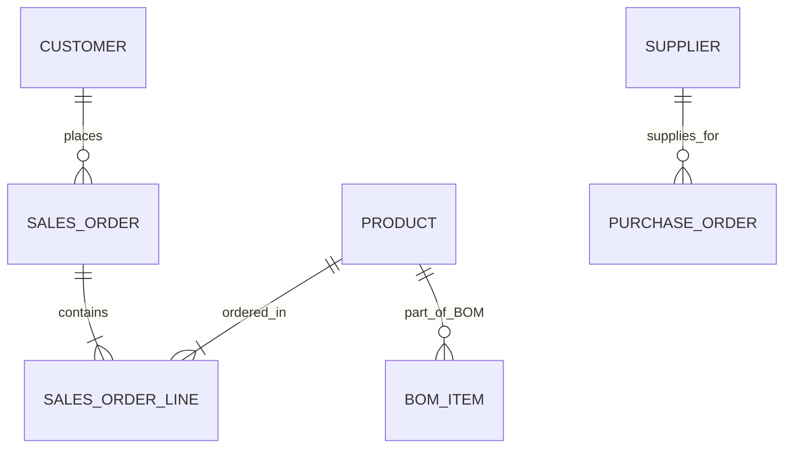
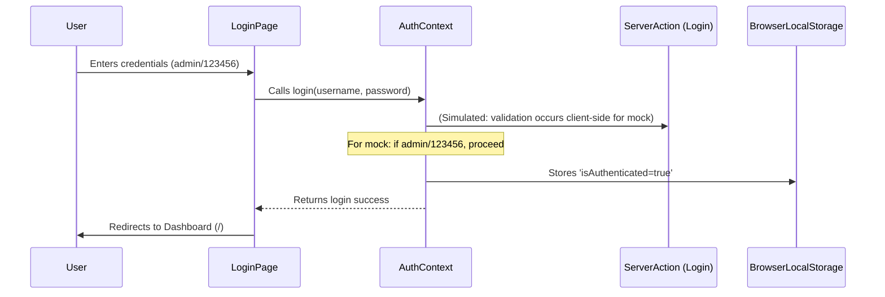
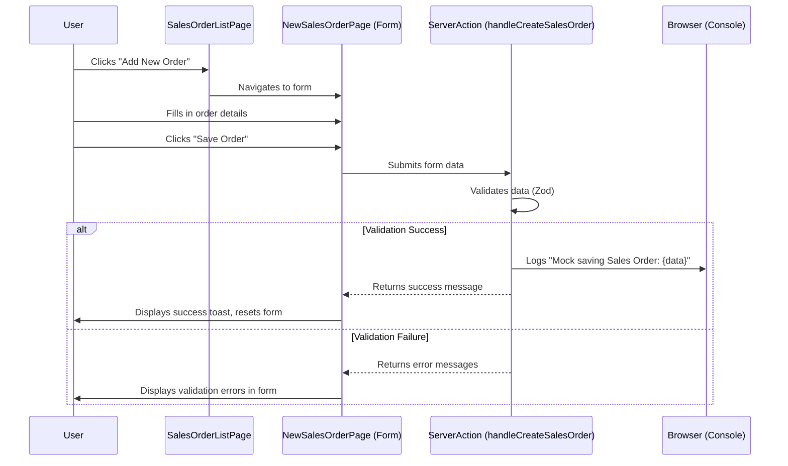

# Specification Document

This document outlines the specifications of the ERP Central application.

## 1. Introduction

Brief overview of the ERP Central system, its purpose, scope, and objectives. ERP Central aims to provide a comprehensive suite of tools for managing various business operations efficiently through a modern web interface with AI-enhanced capabilities.

## 2. System Architecture

### 2.1. High-Level Architecture Diagram
```mermaid
graph TD
    A[Client Browser] --> B(Next.js Frontend - React/ShadCN)
    B --> C{Next.js Backend / API Routes / Server Actions}
    C --> D[Genkit AI Flows]
    C --> E[File System (for .md docs) / Future Database]
    D --> F[LLM Models]
```

### 2.2. Technology Stack
- Frontend: Next.js (App Router), React, TypeScript
- UI Components: ShadCN UI, Lucide React
- Styling: Tailwind CSS
- AI Integration: Genkit (Firebase Genkit)
- Authentication: Mock Client-Side Auth (localStorage) with Server Action for login
- Form Handling: React Hook Form, Zod for validation
- Markdown Rendering: `react-markdown`, `remark-gfm`

## 3. Functional Requirements

### 3.1. User Authentication
- Login Page (`admin`/`123456`)
- Logout Functionality
- Protected Routes

### 3.2. Core ERP Modules (as per navigation)
    - Purchasing Cycle
        - Purchase Request
        - Purchase Order
        - Receiving Slip
        - Goods Receipt Note
        - Vendor Payments
    - Sales Cycle
        - Quotation
        - **Sales Order** (Interactive list, New Order Form with mock save)
        - Sales Invoice
        - Customer Receivables
    - Production Cycle
        - Bill of Materials (BOM)
        - Work Order
        - Production Receipt
    - General Ledger Cycle
        - Voucher
        - Journal
        - Main Ledger
        - Trial Balance
    - Costing Cycle
        - Cost Calculation
        - Cost Analysis
    - Payroll Cycle
        - Employee Salary Calculation
        - Salary Disbursement
    - Fixed Assets Cycle
        - Asset Management
        - Depreciation Calculation
    - Cash Flow Cycle
        - Bank Transactions
        - Cash Flow Statement

### 3.3. Smart Data Discovery
- AI-powered search to suggest reports/data.

### 3.4. Administrator Document Management
- View README.md
- View spec.md (this file)
- View todolist.md
- (Future: Edit documents)

### 3.5. Administrator User Management
- View mock user accounts.
- Access form to (simulate) adding new users.
- Placeholder for permission settings.

## 4. Non-Functional Requirements
- Performance: Fast load times, responsive UI.
- Usability: Intuitive navigation, clear information presentation.
- Scalability: (Placeholder for future considerations, especially regarding database integration)
- Security: Basic auth implemented, further security measures for production.

## 5. Data Model / Entity Relationship Diagram
(Placeholder for detailed ERD. Initial focus on individual module data structures as needed for forms.)

*Note: This ERD is a high-level placeholder.*

## 6. Use Case Diagrams / Scenarios

### 6.1. User Login Scenario


### 6.2. Admin Views Document
```mermaid
sequenceDiagram
    participant Admin
    participant AdminPage (e.g., View README)
    participant NextServer (File System)
    participant ViewDocumentClient

    Admin->>AdminPage: Clicks 'View README'
    AdminPage->>NextServer: Requests README.md content (Server Component reads file)
    NextServer-->>AdminPage: Returns markdown content
    AdminPage->>ViewDocumentClient: Passes markdown content as prop
    ViewDocumentClient-->>Admin: Displays rendered markdown
```

### 6.3. Create New Sales Order (Mock Save)


## 7. UI/UX Design
- Primary color: Blue (`#4681C4`)
- Background color: Light gray (`#F0F4F8`)
- Accent color: Teal (`#3E8A8A`)
- Fonts: Poppins (Headlines), PT Sans (Body)
- Consistent use of ShadCN UI components for a modern, professional look.

## 8. Future Enhancements
- Role-Based Access Control (RBAC)
- **Full database integration for all modules for persistent storage.**
- Editing functionality for Administrator-managed documents.
- Complete implementation of all features for each ERP module page.
- Unit and Integration Tests.
- Internationalization (i18n) - if revisited.
```